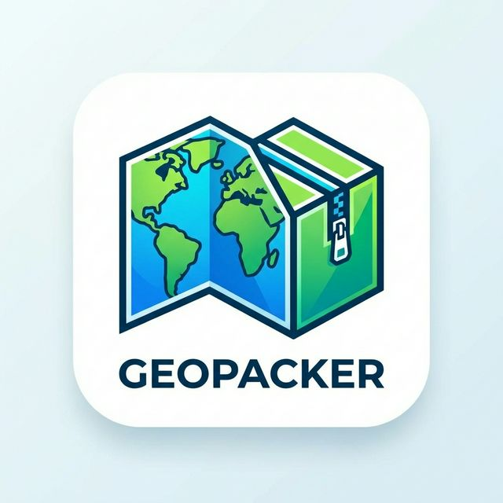

  

# Geopacker QGIS Plugin

**Geopacker** is a QGIS plugin designed to solve the headache of broken paths when sharing QGIS projects. It bundles your entire current project (`.qgz`), vector layers, and raster layers into a single, clean `.zip` file ready to be shared. 

Unlike the native "Package Layers" tool, Geopacker actually modifies the bundled `.qgz` project to use relative paths, ensuring that whoever opens your packaged zip file will see exactly what you see, without a single broken link warning.

## Why Geopacker? (The Problem Solved)

Sharing QGIS projects often results in broken file paths because standard tools simply export data without updating the project file's references. Geopacker bridges this gap.

| Feature | QGIS "Package Layers" | Geopacker |
| --- | --- | --- |
| **Project Path Linking** | ❌ Leaves `.qgz` untouched (links break upon sharing). | ✅ Safely rewrites `.qgz` XML to use perfect **relative paths**. |
| **Raster Data Support** | ❌ Ignores raster files entirely. | ✅ Automatically copies and links local **rasters** safely. |
| **Raster Sidecar Files** | ❌ N/A. | ✅ Smartly packages `.tfw`, `.prj`, `.aux.xml` with rasters using verified GDAL associations so georeferencing isn't lost. |
| **Media Assets (SVGs, Logos, Backgrounds)** | ❌ Leaves absolute local paths that break print layouts. | ✅ Detects local Print Layout images, backgrounds, and SVG markers, packing them into a relative `media/` folder. |
| **Layer Styling (Colors/Categories)** | ❌ External `.qml` styles are left behind. | ✅ Automatically detects and packages associated `.qml` files so map layouts look identical. |
| **Duplicate Checking** | ❌ Blindly processes duplicates, inflating file size. | ✅ Actively detects and **strips duplicate** layer sources. |
| **Empty Layers** | ❌ Packages empty workspace/scratch layers. | ✅ Automatically **trims out empty** memory layers. |
| **Remote Layers** | ❌ Attempts to download massive WFS datasets. | ✅ Safely **skips remote vectors**, keeping them linked online. |
| **Final Output** | ❌ Yields a loose, unmanaged GeoPackage file. | ✅ Generates a **single, safe, email-ready `.zip`** archive containing a detailed `packaging_report.txt`. |

## Features
- **Consolidates Vectors**: Exports all valid shapefiles, GeoJSONs, etc. into a single `packaged_data.gpkg`.
- **Collects Rasters & Sidecars**: Automatically bundles local rasters alongside any matching sidecar files (like `.tfw` or `.prj`) into a unified `rasters/` directory using GDAL associations.
- **Packages Layouts & SVGs**: Scans QGIS Projects for local custom SVGs, Print Layout images, and layout backgrounds, copying them to a `media/` folder and rewriting their paths to be relative.
- **Preserves Layer Styles**: Detects and bundles loose `.qml` style files alongside vector datasets so your map categorization and layout colors never break.
- **Smart Path Remapping**: Behind the scenes, the plugin unzips a copy of your `.qgz` project, parses the underlying XML, and updates all layer and media data sources to point to the new relatively-pathed items.
- **Dynamic ZIP Naming**: The QGIS project file securely nested inside the ZIP archive takes on the same matching name as your exported zip file (e.g., `MyProject.zip` will contain `MyProject.qgz`).
- **Smart Trimming**: Optional checkboxes to strip out empty memory layers and duplicate layer sources to keep your packaged file size down.
- **Remote Layer Protection**: Automatically detects remote vectors (e.g. WFS/Online) and securely skips downloading them while retaining their dynamic online links in the final project.
- **Graceful Error Handling**: Actively protects you by deleting partial ZIP exports if an unrecoverable system error occurs mid-process, ensuring no corrupt maps are sent.
- **Error Reporting**: Informs you of exactly which layers were skipped or failed to export.

## Installation
1. Download a Geopacker ZIP release from this repository.
2. In QGIS, navigate to **Plugins** > **Manage and Install Plugins...**
3. Select **Install from ZIP**, choose the downloaded file, and click Install.
4. The Geopacker icon will appear in your Plugins toolbar.

## Usage
1. Open your target mapping project in QGIS.
2. Click the Geopacker icon or find it under the **Plugins** > **Geopacker** menu.
3. Choose the destination path for your packaged `.zip` file.
4. Check the options to remove duplicates, empty temporary layers, or skip remote vectors if desired.
5. Click **Run**.
6. Wait for the success dialog (which will also list any skipped or failed layers).
7. Share the resulting `.zip` file with your colleagues or clients!

## Requirements
- QGIS 3.0 or higher.
- Python 3 environment (native to QGIS installations).

## Contributing and Bug Reports
Please report any bugs or feature requests on the [GitHub Issues tracker](https://github.com/rick2x/geopacker/issues).
